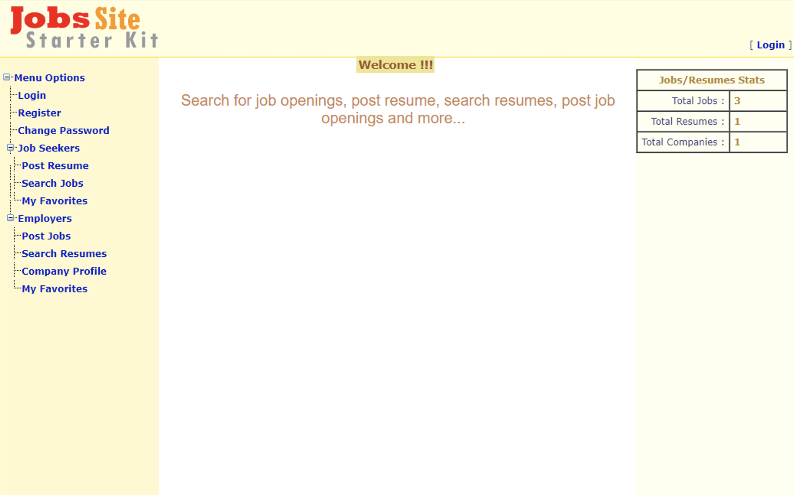

# jobs-app

This is a sample .NET 2.0 application used to demonstrate migration to Docker Containers. 

## Application

Jobs Site is a 2-tier ASP.NET 2.0 application. The server-side frontend is configured to call into a database using Integrated Windows Authentication. 

Set the IIS Application Pool Identity to an account that has been granted permissions in SQL. 

The ConnectionString in [`web.config`](./app/web.config) will need to be updated to refer to your database server.

## Database

A [`.bak`](./database/Jobs.bak) file is provided as a backup for the application database. Restore this file into MS SQL Server to have the schema and sample data available. 